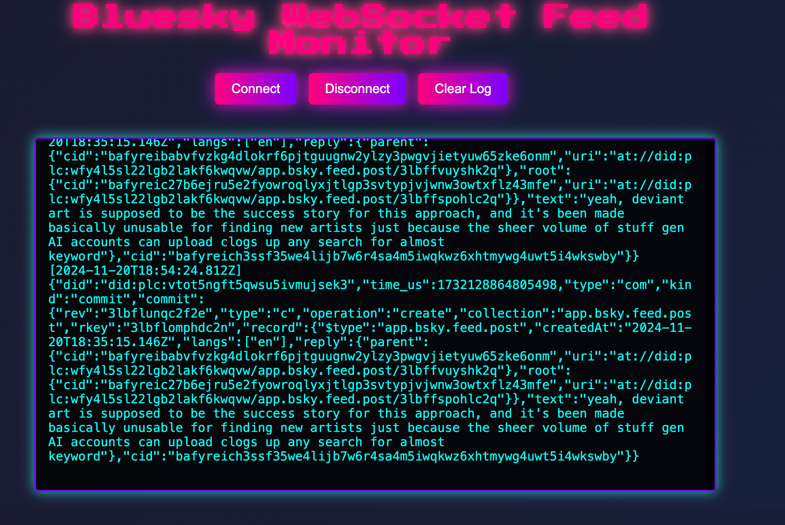

# Bluesky WebSocket Feed Monitor

This is a Python Flask web application that monitors and logs messages from a WebSocket feed. It provides a simple interface to connect, disconnect, and view messages in real-time.



## How is this done

The flask app is actually just connecting to websocket 
`wss://jetstream2.us-east.bsky.network/subscribe?wantedCollections=app.bsky.feed.post` . It is a fork of a [javascript project](https://simonwillison.net/2024/Nov/20/bluesky-websocket-firehose/) that I wanted to port very quickly to Python. 

Bluesky's Jetstream isn't their main `atproto` firehose - that's a more complicated protocol involving CBOR data and CAR files. Jetstream is a new Go proxy that provides a subset of that firehose over WebSocket. Just the thing however for some quick results.


## Features

- **Connect to WebSocket**: Establish a connection to a predefined WebSocket URL.
- **Real-Time Logs**: Display messages received from the WebSocket in real-time.
- **Clear Logs**: Clear the log view with a single button.
- **Disconnect**: Gracefully disconnect from the WebSocket.

## Project Structure

```plaintext
websocket_monitor/
├── app.py                # Flask application with WebSocket functionality
├── templates/
│   └── index.html        # Frontend HTML template
├── static/
│   ├── style.css         # CSS styling for the frontend
│   └── script.js         # JavaScript logic for frontend interactivity
```
